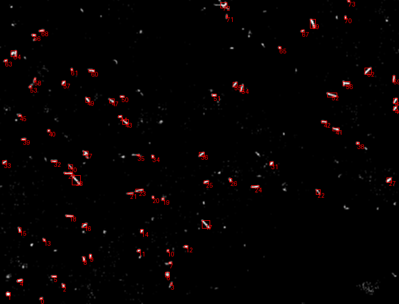
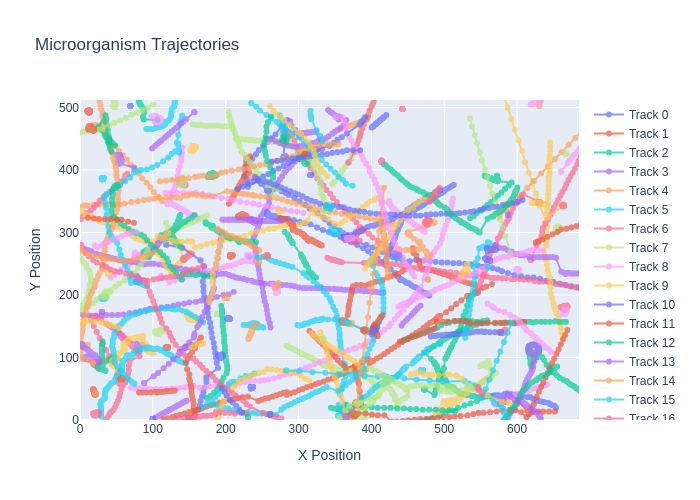
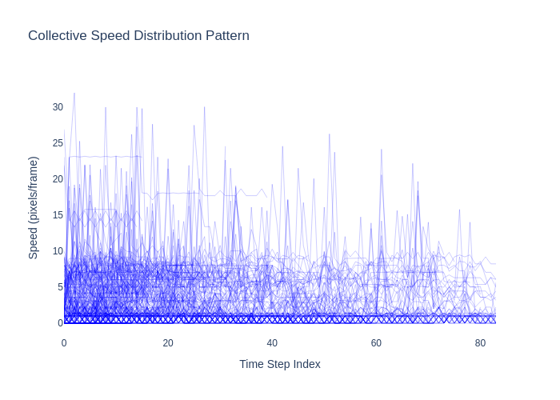
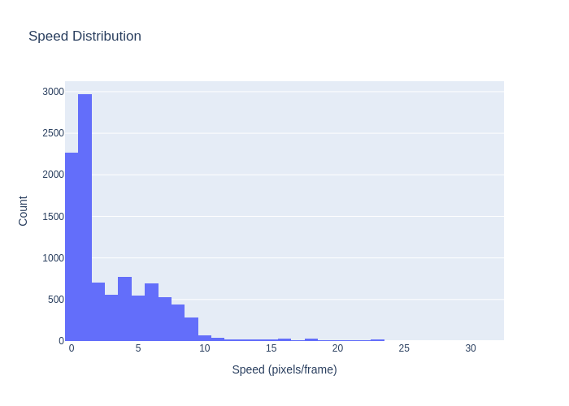

# Microorganism Computer Vision 🧫

[](https://opensource.org/licenses/Apache-2.0)
[](https://www.python.org/)

A comprehensive computer vision pipeline for analyzing microorganism 🦠 motility patterns and diffusion characteristics.

Deadline: 28th February 2025

<div align="center">
  
  
  
</div>

## 🌟 Features

- **Multi-modal Tracking**
  - Optical flow-based motion estimation
  - Kalman-filter enhanced object detection
  - Synthetic trajectory generation
- **Advanced Diffusion Analysis**
  - 6 statistical hypothesis tests for motility patterns
  - Automated trajectory classification
  - Comprehensive visualization toolkit
- **Scalable Architecture**
  - Modular pipeline design
  - Configurable hypothesis parameters
  - Batch processing capabilities

## 🧩 Diffusion Hypothesis Tests

Our framework implements sophisticated statistical tests to characterize microbial motion:

| Hypothesis Test | Key Mechanism | Biological Relevance |
|-----------------|---------------|----------------------|
| **Circular Motion** <br> `CircularMotionTest` | Curvature analysis + rotation angle detection | Magnetotactic bacteria, spiral-seeking organisms |
| **Directional Switching** <br> `DirectionalSwitchTest` | Fourier analysis of angular changes | Run-and-tumble motility (e.g., *E. coli*) |
| **Gaussian Random Walk** <br> `GaussianRandomWalkTest` | Kolmogorov-Smirnov normality test | Passive diffusion in isotropic environments |
| **MSD Linear Fit** <br> `MSDLinearTest` | R² evaluation of mean squared displacement | Normal diffusion processes |
| **Persistent Motion** <br> `PersistentMotionTest` | Velocity autocorrelation analysis | Active transport mechanisms |
| **Subdiffusion** <br> `SubDiffusionTest` | Power law exponent ($\alpha < 1$) detection | Crowded environments, viscoelastic media |


## 🚀 Installation

```bash
# Clone repository
git clone git@github.com:Ophiase/Microorganism-Computer-Vision.git
cd Microorganism-Computer-Vision

# Install dependencies
make pip

# Download sample dataset
make extract
```

## 🧪 Usage

Process real videos:
```bash
# Full pipeline execution
make transform      # Preprocess videos
make detection      # Track microorganisms
make render         # Generate gifs
make analysis       # Run statistical tests and graphics
```
Generate synthetic data:

```bash
make synthetic      # Create trajectory datasets
python3 -m script.main --task analysis --video synthetic_brownian
# "brownian" can be replaced by directed, sinusoidal, confined, ctrw, ...
```

Key Makefile Targets:

```makefile
detection     # Track objects in videos
render        # Generate trajectory visualizations
analysis      # Perform statistical testing
synthetic     # Generate synthetic trajectories
```

## 📊 Results Interpretation


- <div style="text-align: center;">
  
  
</div>

- <div style="text-align: center;">
  
  
</div>

## 📂 Data Structure

```bash
microorganism-cv/
├── data/                           # Raw and processed data
│   ├── preprocessed/               # Normalized video tensors
│   └── tracking/                   # Trajectory datasets
├── logic/                          # Core algorithms
│   ├── diffusion/                  # Statistical tests
│   ├── filters/                    # Image processing
│   └── structure/                  # Data models
├── script/                         # Pipeline components
└── visualization/                  # Plotting utilities
```

## 📚 Methodology
Our pipeline implements a multi-stage analysis process:

### Preprocessing
- Optical flow estimation
- Spatial normalization
- Noise reduction

### Object Detection
- Adaptive thresholding (❌ not implemented)
- Connected component analysis
- Kalman-filter based tracking

### Trajectory Analysis
- [MSD](https://en.wikipedia.org/wiki/Mean_squared_displacement) calculations
- Velocity autocorrelation
- Directional persistence metrics

### Statistical Classification
- Hypothesis testing
- Confidence interval estimation (❌ not implemented)
- [Motility](https://en.wikipedia.org/wiki/Motility) pattern classification
