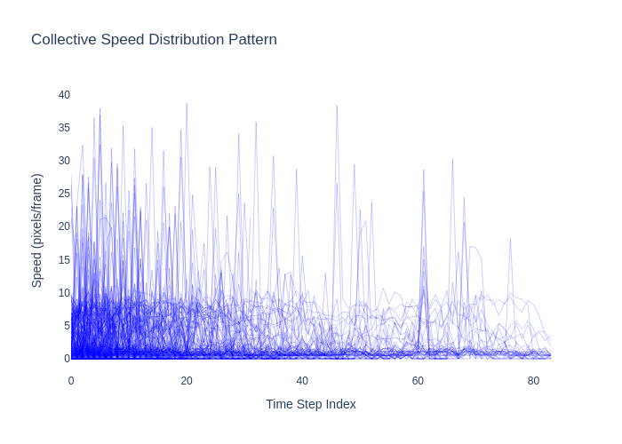

# Microorganism Computer Vision 🧫

Deep Computer Vision 🦠 - Analysis of the motion of microorganisms

- <div style="text-align: center;">   </div>

## Execution

```bash
# install dependencies
make pip
# download the dataset
make extract
# preprocess the videos
make transform
# extract trajectories
make detection
# render trajectories
make render
# render trajectories's analysis
make analysis
```

## Results


- <div style="text-align: center;">
  
  
</div>

- <div style="text-align: center;">
  
  
</div>

## TODO (Deadline: February 30th, 2025)

- ✅ Find videos of microorganisms
    - ✅ Download and extract them
- ✅ Optical Flow
    - ✅ Check the associated vector field
    - Plot the vector field with a quiver plot
- Cluster entities
    - ✅ Compute the image gradient and optical flow gradient for each frame
        - Deduce clusters
    - ✅ Object detection on each frame 
    - ✅ Kalman Filter to ensure tracking (bbox id)
    - ✅ Visualize the entities in the video
- Motion analysis
    - ✅ Create the time series
        - Depends on the information we can extract from the microorganisms
            - E.g., Salmonella
        - Proposition:
    - ✅ Propose diffusion hypotheses (e.g., Gaussian Random Walk)
    - ✅ Perform statistical tests

- Experimental:
    - Simulate videos to train a segmentation model
    - Simulate trajectories to verify the statistical tests